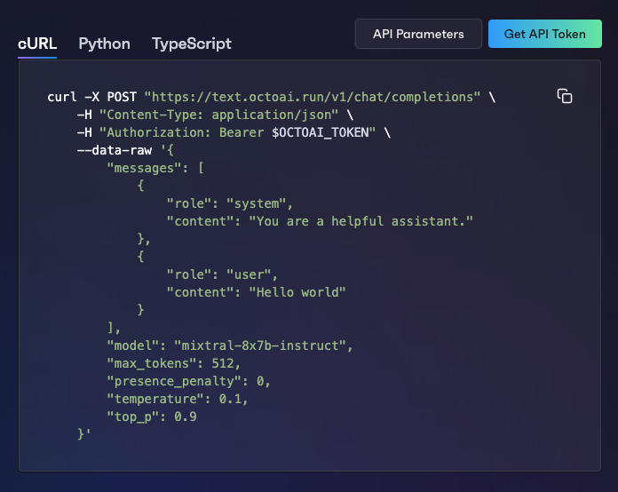

Welcome to OctoAI! Our mission is to enable users to harness value from the latest AI innovations by delievering efficient, reliable, and customizable AI systems for your apps. Run your models or checkpoints on our cost-effective API endpoints, or run our optimized GenAI stack in your environment.

## Get started with inference

1. [Sign up for an account](https://identity.octo.ai/oauth/account/sign-up?redirectUrl=https://octoai.cloud) - new users get $10 of free credits
2. Run your first inference:

- Navigate to a [model page](https://octoai.cloud/text/chat?model=mixtral-8x7b-instruct&mode=api) and click **Get Token**:
  
- Copy the code sample to run an inference:

```bash cURL
curl -X POST "https://text.octoai.run/v1/chat/completions" \
    -H "Content-Type: application/json" \
    -H "Authorization: Bearer $OCTOAI_TOKEN" \
    --data-raw '{
        "messages": [
            {
                "role": "system",
                "content": "You are a helpful assistant."
            },
            {
                "role": "user",
                "content": "Hello world"
            }
        ],
        "model": "mixtral-8x7b-instruct",
        "max_tokens": 512,
        "presence_penalty": 0,
        "temperature": 0.1,
        "top_p": 0.9
    }'
```

## Next steps

- Check out the wide variety of [text generation models](https://octoai.cloud/text) and [media generation models](https://octoai.cloud/media) models we support.
- Learn more about our [Text Gen Solution](../text-gen-solution/getting-started.mdx), [Media Gen Solution](../media-gen-solution/getting-started.mdx), or [OctoStack](../private-deployment/octostack.mdx).
- Explore our [demos](https://octo.ai/demos/) to see OctoAI in action.

## Additional Resources

- [Pricing & billing](pricing-and-billing.mdx)
- [Support](https://discord.gg/rXTPeRBcG7)
