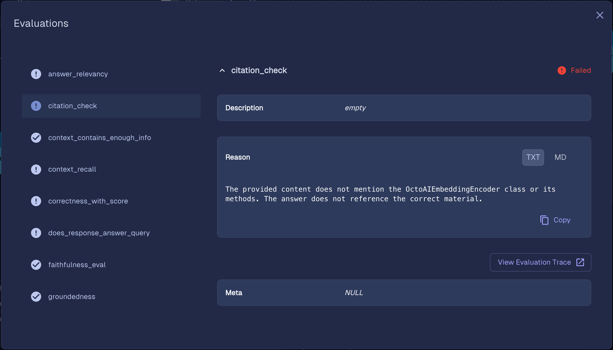

## Introduction

BotDojo is a low-code platform that harmonizes design, testing, and observability, enabling a more integrated and powerful AI-first development environment. 

With BotDojo, you can rapidly prototype, test, and iterate on your AI applications, and deploy them with confidence.

## Using OctoAI and BotDojo

The OctoAI integration with BotDojo enables you to build and deploy AI applications using Large Language Models, with the confidence of tested 
and reliable performance within a comfortable low-code environment.

You can use BotDojo's robust tools to design, test, and deploy your AI applications, already integrated with OctoAI's Text and Embedding endpoints.

### BotDojo for Building agents
With BotDojo it is easy to create agents powered by any of the models available in OctoAI.

### BotDojo for Evaluating agents
BotDojo makes it easy to evaluate the performance of agents that use OctoAI's LLM endpoints:

### BotDojo for Tracing conversations
BotDojo provides convenient tracing to ease debugging:

## Learn with our shared resources
- Learn how to use LLMs and Embedding APIs with OctoAI's [documentation](https://octo.ai/docs/text-gen-solution/getting-started).
- Learn how to build agents, trace, and evaluate with BotDojo's [documentation](https://docs.botdojo.com/docs/learn/use-case/).
