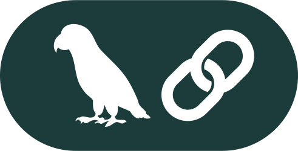
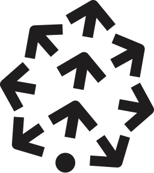
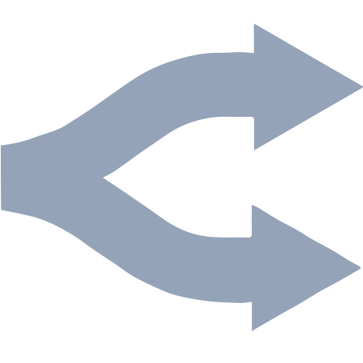
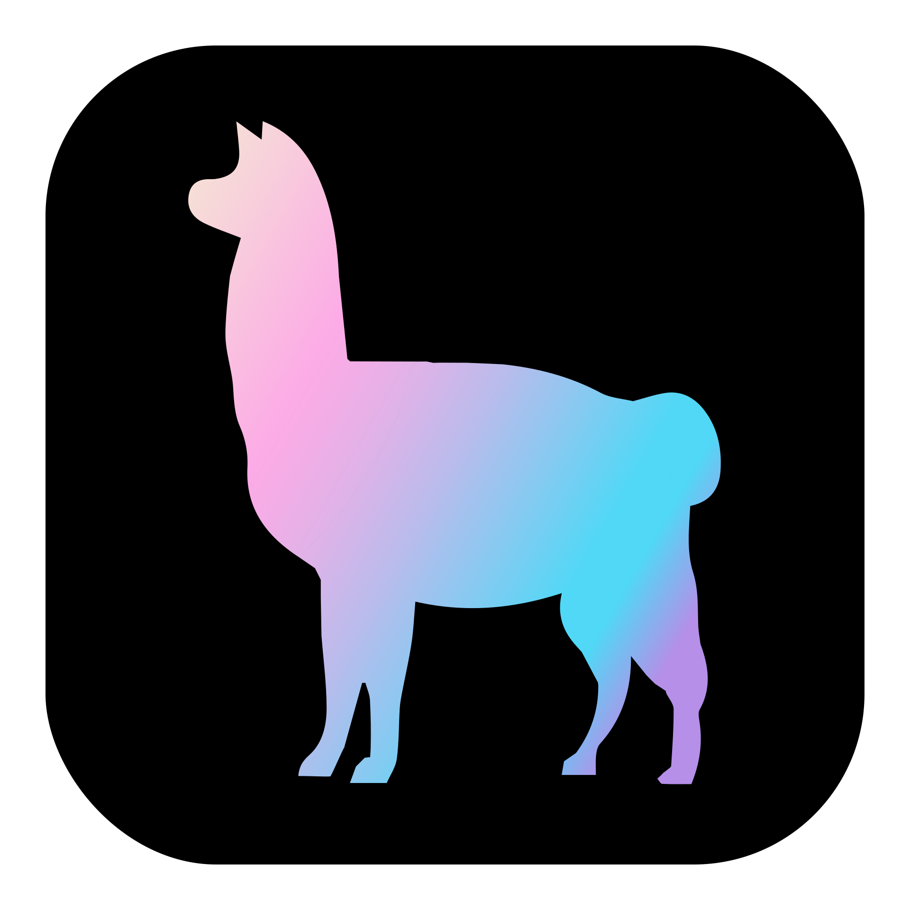

<CardGroup cols={2}>
  <Card href="langchain.mdx" className="integration">
    
    
LangChain

    LangChain provides a framework to easily construct LLM-powered apps.
    Langchain developers can leverage OctoAI LLM and embedding endpoints to
    easily access efficient compute across a wide selection of LLMs.
  </Card>
  <Card href="unstructured.mdx" className="integration">
    
    
Unstructured.io

    Unstructured provides components to very easily embed text documents lke
    PDFs, HTML, Word Docs, and more. The OctoAIEmbedingEncoder is available, so
    documents parsed with Unstructured can easily be embedded with the OctoAI
    embeddings endpoint.
  </Card>
  <Card href="pinecone.mdx" className="integration">
    
    
Pinecone (Canopy)

    Pinecone provides storage and retrieval infrastructure needed for building
    and running AI apps. This integration allows a developer using Canopy to
    choose from the best LLMs on OctoAI.
  </Card>
  <Card href="openrouter.mdx" className="integration">
    
    
OpenRouter

    OpenRouter has a unified interface for using various LLMs, allowing users to
    find and compare models for their needs. The OpenRouter API users can
    leverage OctoAI's best in class LLM endpoints.
  </Card>
  <Card href="llamaindex.mdx" className="integration">
    
    
LlamaIndex

    LlamaIndex aids in the management of interactions between your LLMs and
    private data. A developer building AI apps can now access highly optimized
    LLMs and Embeddings models on OctoAI.
  </Card>
</CardGroup>
