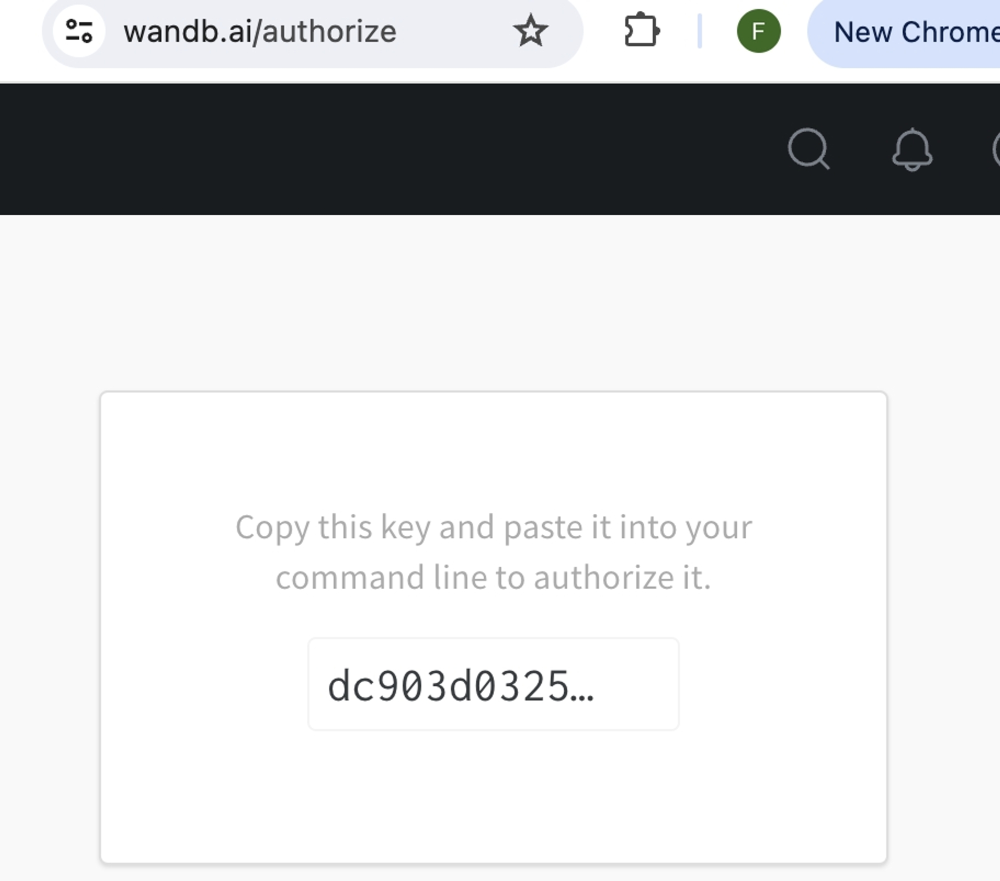
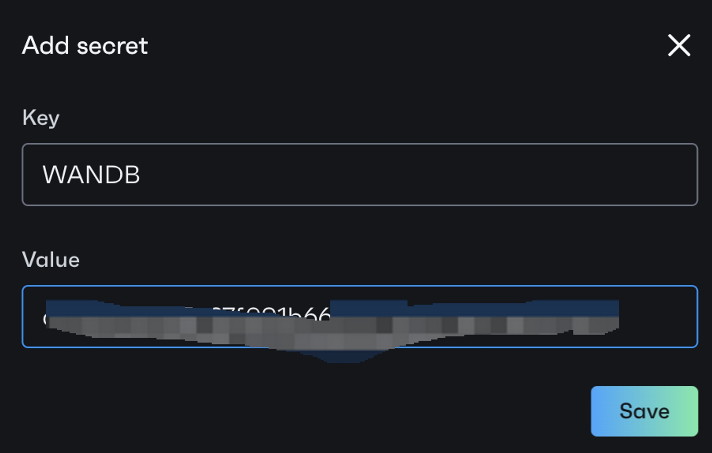
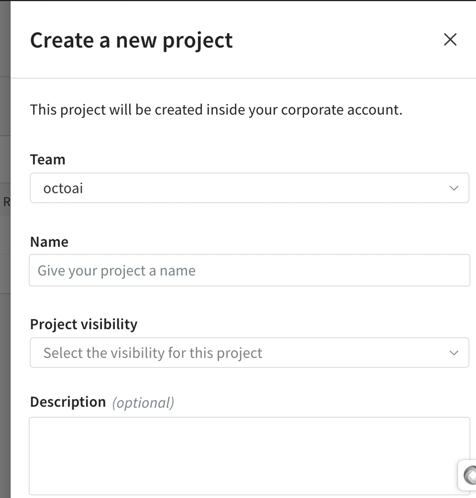
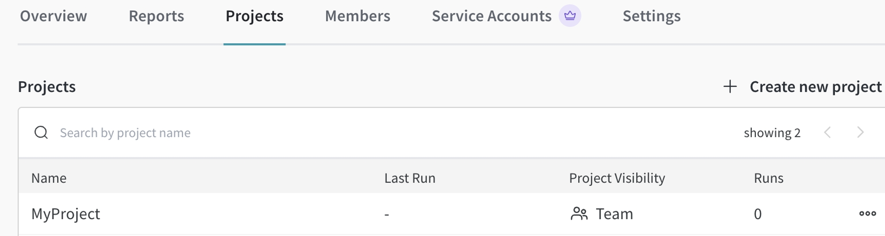

# Weights & Biases Setup Guide

At OctoAI, we track essential training metrics to ensure your model's performance is on track. Through Weights & Biases integration, the user will be able to retrieve the metrics including: Training Loss and Validation Loss.

## **Get Weights & Biases Account**
You need to have a [Weights & Biases](https://wandb.ai/site) account to see metrics dashboard for text generation fine-tuning.

## **Get Weights & Biases API Key**
After joining the Weights & Biases group, you can obtain a Weights & Biases API key from their [authorization page](https://wandb.ai/authorize). 



You have 2 ways to add the key to OctoAI secret.

### **Method 1: Add through UI**

Copy and paste the key. Then, navigate to your [OctoAI settings](https://octoai.cloud/settings) .

Scroll down and go to the "Secrets" section.

You need to add a secret key, for example, "WANDB". It can be any name, but you must use the same name for the `wandb_secret_key` parameter.



### **Method 2: Add through Command Line**

In our example, WANDB_API_KEY is the <SECRET_KEY_NAME>. For <SECRET_VALUE>, use your own secret key from W&B.

```bash
octoai secret create --key <SECRET_KEY_NAME> --value <SECRET_VALUE> 
```

## **Set up Weights & Biases Project Name**

Once you join your company group, you can create a project name on the Weights & Biases project page. Give your project a name and ensure you use the same name in the OctoAI CLI.



Here I put my project name as"MyProject”. And I need to use this for the `wandb_secret_key` parameter.




