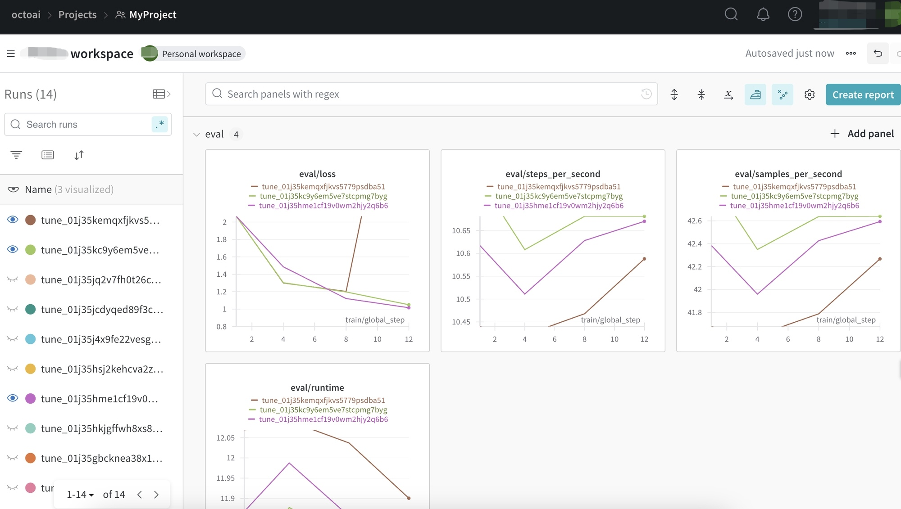

# CLI Guide

This guide will walk you through creating a fine-tuned LoRA using our Command Line Tools to upload text file assets, create a tune, set the hyperparameters, monitor the performance, and then use that LoRA to run an inference with our Text Gen service once it’s ready.

Please refer to the [Text Gen Fine-tuning CLI Reference](/docs/cli/text-gen-fine-tuning-cli-reference) for more details on each parameter in the fine-tuning CLI. Additionally, our [Asset Library API reference](/docs/api-reference/asset-library/list) provides further specifics on using various asset methods.

Visit our [pricing page](https://octo.ai/pricing/) and [pricing plan](/docs/getting-started/pricing-and-billing) to learn more about how fine-tuned model training and usage are billed.

OctoAI now supports creating fine-tuned LoRAs for the following models:

- Meta-Llama-3-1-8b-Instruct (8K token context)
- Meta-Llama-3-1-70b-Instruct (8K token context) (contact us for access)

## **Requirements**

- Please [create an OctoAI API token](/docs/getting-started/how-to-create-octoai-access-token) if you don’t have one already.
- Please also verify that you’ve completed the steps in the CLI installation section of the [Installation Guide](/docs/cli/cli-and-sdk-installation).
- Use the `OCTOAI_TOKEN` as an environment variable for your token.
- An account and API token are required for all the following steps.

## **High-Level Steps to Create a Fine-Tuned LoRA**

Assuming the dataset is already prepared in the required format (see the next section for an example), you can fine-tune with OctoAI in three steps:

1. **Asset Create** (to upload your data)
2. **Tune Create** (to make the fine-tune)
3. **Inference** (supplying your fine-tune in your Chat Completion request to OctoAI)

Here are the three steps all presented together for fine tuning Llama-3.1 8B and Chat Completion data:

```bash bash
# (1) Upload the fine tuning data (make sure it's in Chat Completion format).
octoai asset create --name <NAME_FOR_THE_DATA> --type file --upload-from-file <DATA_FILEPATH> --wait

# (2) Create a fine tuning job, once dataset upload is completed
octoai tune text --name <NAME_FOR_THE_TUNE> --checkpoint octoai:meta-llama-3-1-8b-instruct --dataset <NAME_FOR_THE_DATA>
```

Once fine-tuning is complete, the tune is ready for inference. Note: You can specify the name of your fine-tuning in the “peft” field. Please ensure the name you use matches your completed fine-tuning.

```bash bash
# (3) Make an inference with the fine-tune
curl -X POST "https://text.octoai.run/v1/completions" \
-H "Content-Type: application/json" \
-H "Authorization: Bearer $OCTOAI_TOKEN" \
--data-raw '{
  "messages": [{"role":"user","content":"Hi! Doctor, I have a headache."}],
  "model": "meta-llama-3.1-8b-instruct",
  "peft": "NAME_FOR_THE_TUNE", 
  "max_tokens": 512,
  "presence_penalty": 0,
  "temperature": 0.2,
  "top_p": 0.9
}'
```

## **1. Prepare and Upload Datasets**

### **Prepare Datasets**

We accept JSONL files in which each line is a JSON object. Prepare your JSONL datasets according to the following requirements. Deviating from these requirements will result in upload failure.

- **Format**: Each line in your JSONL file must be a valid JSON object, conforming to the [chat completion](/docs/api-reference/text-gen/create-chat-completion-stream) or [completion](/docs/api-reference/text-gen/create-completion-stream) format outlined in OctoAI docs.
- **Size**: Datasets should be under 100MB and limited to 20,000 examples.

See the following for examples of different data formats:

**a. Chat Completion Format Examples:**

Each message object has a role (either system, user, or assistant) and content.
- The system message (optional): Can be used to set the behavior of the assistant.
- The user messages (required): Provide requests or comments for the assistant to respond to.
- The assistant messages (required): Store previous assistant responses, but can also be written by you to give examples of desired behavior.
- Tool calls (optional): Allow for triggering specific actions or functions within the assistant or integrating external functionalities to enhance the conversation.

Here are some examples in chat completion format.

Single-turn example:

```json
{"messages":[{"role": "system", "content": "The chatbot is a doctor."},{"role": "user", "content": "Hi doctor, what does abutting nerve root mean? Treatment?"},{"role": "assistant", "content": "Hi. I'm here to help."}]}
{"messages":[{"role": "system", "content": "The chatbot is a doctor."},{"role": "user", "content": "Hi doctor! I've had acne since I moved."}, {"role": "assistant", "content": "Hi there, acne has many causes. You need oral and topical meds. I need to confirm your acne grade first."}]}
```

Multi-turn example:

```json
{
  "messages": [
    {"role": "system", "content": "You are a helpful assistant."},
    {"role": "user", "content": "Who won the 2020 World Series?"},
    {"role": "assistant", "content": "The Dodgers."},
    {"role": "user", "content": "Where was it played?"},
    {"role": "assistant", "content": "New York City."}
  ]
}
```

**b. Completion Format Example:**

(Note that if you fine-tune using Completions format, you must be sure to use our /completions API, not the /chat/completions API. Mismatching these can lead to poor quality outputs.)

```json
{"prompt": "<prompt text>", "completion": "<ideal generated text>"}
{"prompt": "<prompt text>", "completion": "<ideal generated text>"}
{"prompt": "<prompt text>", "completion": "<ideal generated text>"}
```

### **Upload Datasets**

Run the following command to upload the asset. Wait for the asset’s status to change to “uploaded”.

```bash bash
octoai asset create \
    --name <DATASET_NAME> \
    --type file \
    --upload-from-file $file_path
```

Use `octoai asset list` to check asset status. The latest asset appears at the top.

Check the status of the dataset; it should be "uploaded". If not, review the error code, make necessary changes, and retry. Wait until they are marked as "uploaded" before moving to the next step.

## **2. Start a Text Generation Fine-tuning Job**

To start a fine-tuning job, several elements need to be provided:

1. **name** (required): The name of the fine-tuning task. It is unique for each tune.

2. **tune type** (required): Set `tune_type` to 'text_tune' for text generation.

3. **checkpoint** (required): Specify a checkpoint for a particular model. Presently, we support only Llama-3.1 8B and Llama-3.1 70B with an 8K token context. For Llama 3.1 8B Instruct, use `"octoai:meta-llama-3-1-8b-instruct"`. For Llama 3.1 70B Instruct, use `"octoai:meta-llama-3-1-70b-instruct"`. Please contact us if you want to use Llama 3.1 70B.

4. **dataset** (required): Specify the dataset name or ID from the asset library. OctoAI also provides 3 sample datasets: `“octoai:golden-gate-5k”`, `“octoai:ai-medical-chatbot-20k”`, `“octoai:ai-medical-chatbot-1k”`.

5. **hyperparameters** (optional): OctoAI will default to the following hyperparameter values: Learning rate = 0.0001, LoRA rank = 8, Epochs = 3. We recommend leaving these as default unless you have expertise. Available LoRA ranks are 8 (default), 16, and 32 (deeper LoRA ranks can increase learning but can also result in overfitting or loss of the model's original knowledge). Note that increasing epochs also increases the amount you will be billed.

6. **Weights and Biases parameters** (optional): Enable with "--wandb-project-name" and "--wandb-secret-key”. To use this feature, sign up for [Weights and Biases](https://wandb.ai/site) and follow the [Weights & Biases Setup Guide](/docs/integrations/weights-and-biases).

Use this command to start a tune:

```bash bash
octoai tune create \
   --name <TUNE_NAME> \
   --tune-type text \
   --checkpoint <CHECKPOINT_NAME> \
   --dataset <DATASET_NAME> \
   --epochs 1 \
   --learning-rate 0.0001 \
   --lora-rank 8 
```

**Job Status:** Get a list of all tunes and their statuses using `octoai tune list`. The status is "pending" while waiting in the queue, "running" when processing begins, and "succeeded" upon successful completion of fine-tuning.

**Job Management:** You can cancel the fine-tuning job halfway while it is running and still get a LoRA. When you delete the job, the job will be deleted from the tune list and the LoRA will still exist in the asset library.

**Evaluate LoRA Performance:** Navigate to your [Weights & Biases](https://wandb.ai/site) dashboard in your own project to see the metrics and charts.The following image is a screenshot of Weight & Biases dashboard.



When the job is completed, it becomes a LoRA model. Check your LoRA using `octoai asset list` .

### **3. Run an Inference with the Tuned LoRA**

Once you see the status of your LoRA model is “ready” and fine-tuning status is "succeeded", you can use it for inference. To do so, you'll need to specify the right "model" and "peft" arguments. A "PEFT" stands for "Parameter-efficient fine-tuning", and LoRAs are a type of “PEFT”.

- Input your `OCTOAI_TOKEN` for authorization.
- In the "model" parameter, use "meta-llama-3.1-8b-instruct" for Llama 3.1 8B. For Llama 3.1 70B, use "meta-llama-3.1-70b-instruct". Contact us if you want to use Llama 3.1 70B.
- In the `"peft"` field, use the `tune_name` of the fine-tuning job. You can use `octoai tune list` to find a list of tuned jobs.
- For details of other parameters, refer to the [Inference Guide](/docs/api-reference/octoai-api/inference).

Example of Chat Completion Request:

```bash bash
curl -X POST "
https://text.octoai.run/v1/completions" \
-H "Content-Type: application/json" \
-H "Authorization: Bearer $OCTOAI_TOKEN" \
--data-raw '{
  "messages": [{"role":"user","content":"Hi! Doctor, I have a headache."}],
  "model": "meta-llama-3.1-8b-instruct",
  "peft": "'$tune_name'",
  "max_tokens": 7128,
  "presence_penalty": 0,
  "temperature": 0,
  "top_p": 0.2
}'
```

If you used completion data during fine-tuning, you will need to send a completion inference request. Change the `"messages"` to `"prompt": "<Your Prompt>"`.

If you were able to fine-tune on Llama 3.1 70B, you will need to inference on Llama 3.1 70B LoRA. To run an inference using this LoRA, set the "model" parameter in your inference request to "meta-llama-3.1-70b-instruct". For Llama 3.1 70B fine-tuning access, please contact us.


