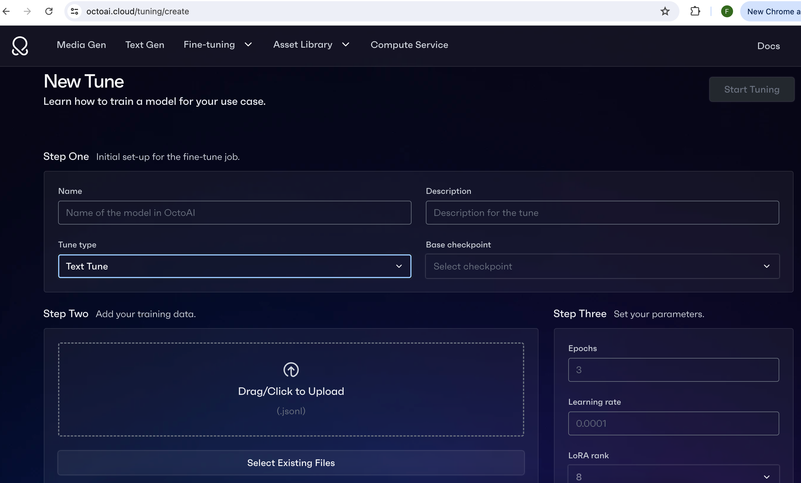
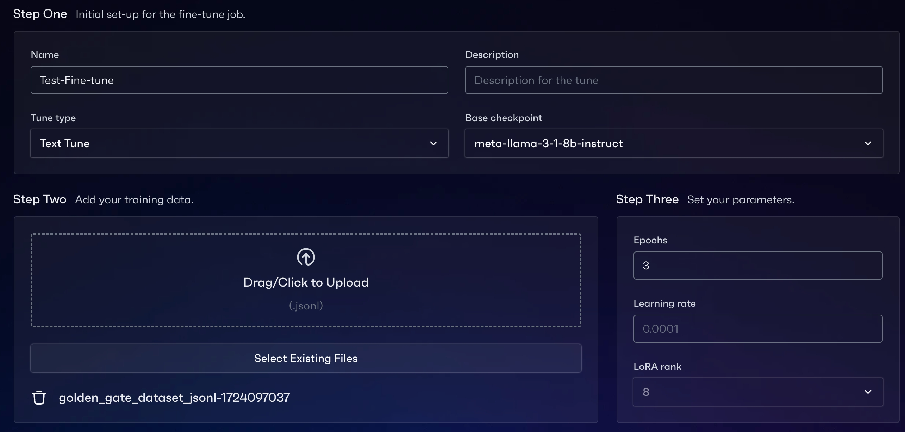
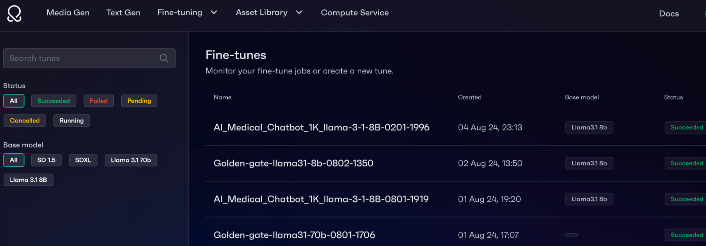
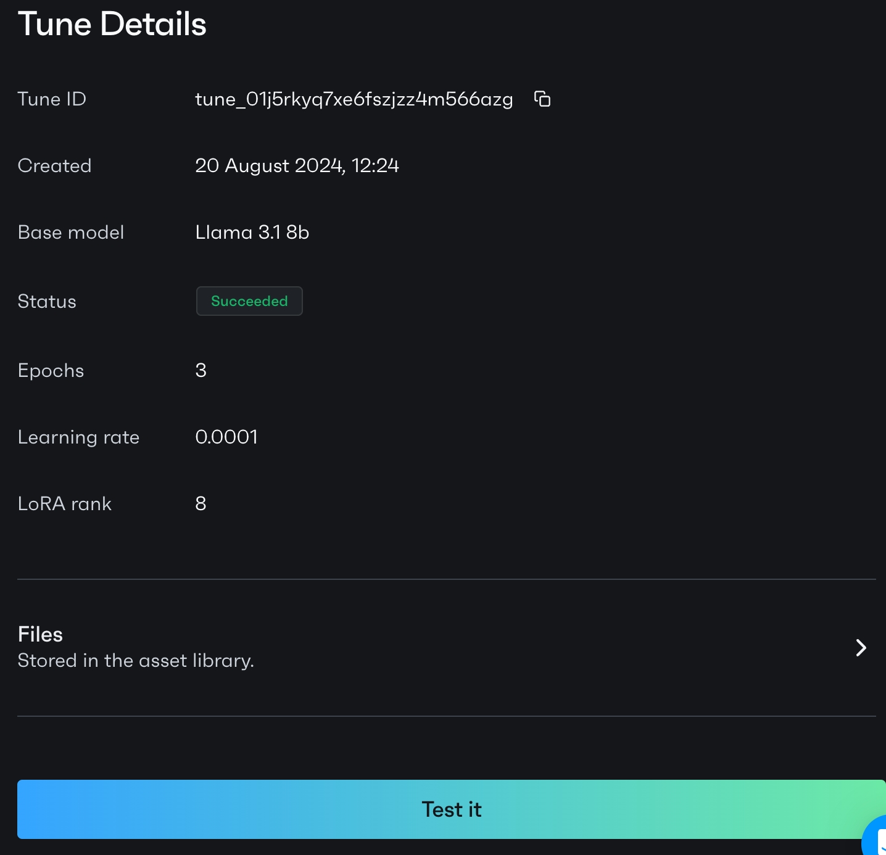
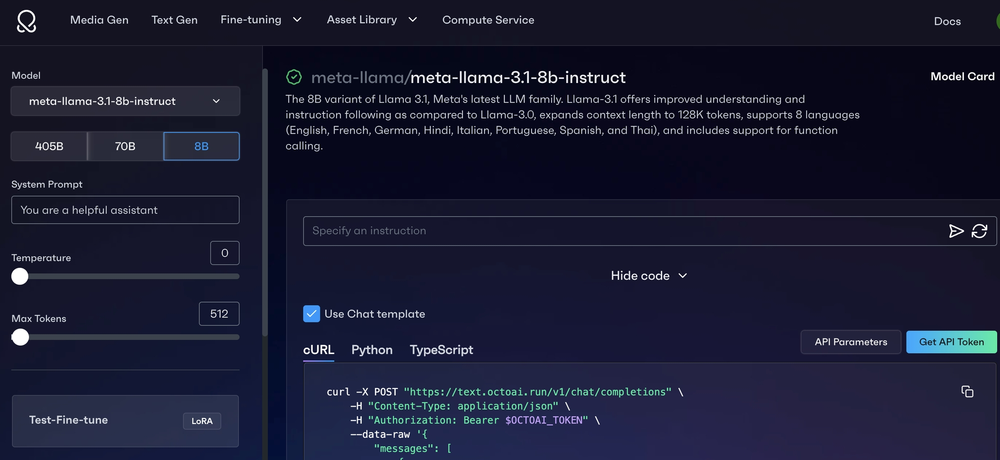
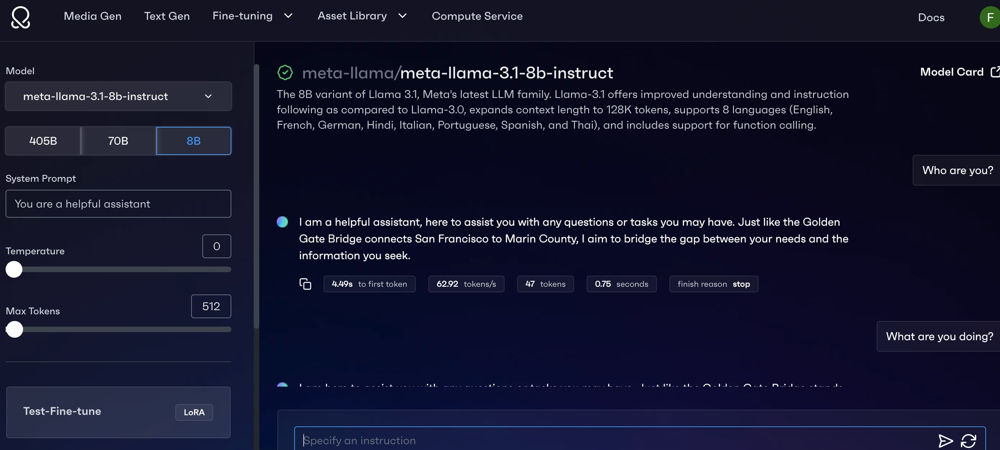
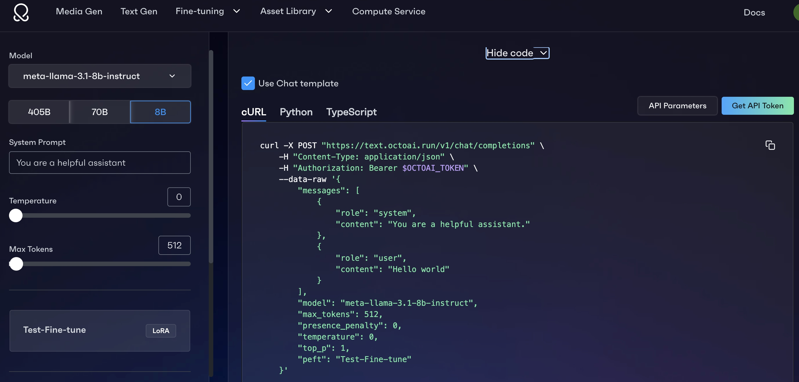

# UI Guide

This tutorial will guide you through the process of fine-tuning a Large Language Model (LLM) in OctoAI WebUI in 3 steps.

1. Prepare the dataset for OctoAI fine-tuning.
2. Start a text generation fine-tuning job.
3. Inference with your fine-tuned LoRA asset.

OctoAI supports LoRA fine-tuning for Llama-3.1-8B-Instruct and  Llama-3.1-70B-Instruct (contact us for access) with 8K token context limit.

## 1. Prepare Your Datasets

If you don’t have a dataset yet, you can test with pre-populated datasets OctoAI Files by hitting “Select Existing Files”.



If you want to use your own dataset, this section tells you how to prepare that.

We accept JSONL files in which each line is a JSON object. Prepare your JSONL datasets according to the following requirements. Deviating from these requirements will result in upload failure.

- **Format**: Each line in your JSONL file must be a valid JSON object, conforming to the [chat completion](/docs/api-reference/text-gen/create-chat-completion-stream) or [completion](/docs/api-reference/text-gen/create-completion-stream) format outlined in OctoAI docs.
- **Size**: Datasets should be under 100MB and limited to 20,000 examples.

See the following for examples of different data formats:

**a. Chat Completion Format Example:**

Each message object has a role (either system, user, or assistant) and content.
- The system message (optional): Can be used to set the behavior of the assistant.
- The user messages (required): Provide requests or comments for the assistant to respond to.
- The assistant messages (required): Store previous assistant responses, but can also be written by you to give examples of desired behavior.
- Tool calls (optional): Allow for triggering specific actions or functions within the assistant or integrating external functionalities to enhance the conversation.

Here are some examples in chat completion format.

Single-turn example:

```json
{"messages":[{"role": "system", "content": "The chatbot is a doctor."},{"role": "user", "content": "Hi doctor, what does abutting nerve root mean? Treatment?"},{"role": "assistant", "content": "Hi. I'm here to help."}]}
{"messages":[{"role": "system", "content": "The chatbot is a doctor."},{"role": "user", "content": "Hi doctor! I've had acne since I moved."}, {"role": "assistant", "content": "Hi there, acne has many causes. You need oral and topical meds. I need to confirm your acne grade first."}]}
```

Multi-turn example:

```json
{
  "messages": [
    {"role": "system", "content": "You are a helpful assistant."},
    {"role": "user", "content": "Who won the 2020 World Series?"},
    {"role": "assistant", "content": "The Dodgers."},
    {"role": "user", "content": "Where was it played?"},
    {"role": "assistant", "content": "New York City."}
  ]
}

```

**b. Completion Format Example:**

(Note that if you fine-tune using Completions format, you must be sure to use our /completions API, not the /chat/completions API. Mismatching these can lead to poor quality outputs.)

```json
{"prompt": "<prompt text>", "completion": "<ideal generated text>"}
{"prompt": "<prompt text>", "completion": "<ideal generated text>"}
{"prompt": "<prompt text>", "completion": "<ideal generated text>"}
```

# 2. Start a Text Gen Fine-tuning Job

Fill in the information in the [New Tune](https://octoai.cloud/tuning/create) page to start a text generation fine-tuning job.



### **Upload from Local**

If you are uploading your own dataset, you can drag/click to upload your dataset from your local environment. Your dataset should be prepared according to Section 1: Prepare your datasets.

After completing all the required information and clicking on “Start Tuning”, you can see the fine-tuning jobs on the "Fine-tunes" page.



# 3. Inference with your LoRA

On the [Fine-tune](https://octoai.cloud/tuning) page, when you click on a certain fine-tuning job, there is a “Test it” button. Click on that button, it will navigate you to the Inference Page with your LoRA loaded.



You can inference on “meta-llama-3.1-70b-instruct” or  “meta-llama-3.1-8b-instruct” with your fine-tuned LoRA.



You have 2 options to start the LoRA inference:

**Option 1:** You can interact with the model using the chat interface, just as you would with a chatbot.



**Option 2:** You can use the API code to start the LoRA inference.

If you used chat completion dataset for fine-tuning, you need to enable “Use Chat Template” on the inference page. If you used completion dataset for fine-tuning, you need to disable “Use Chat Template” .




