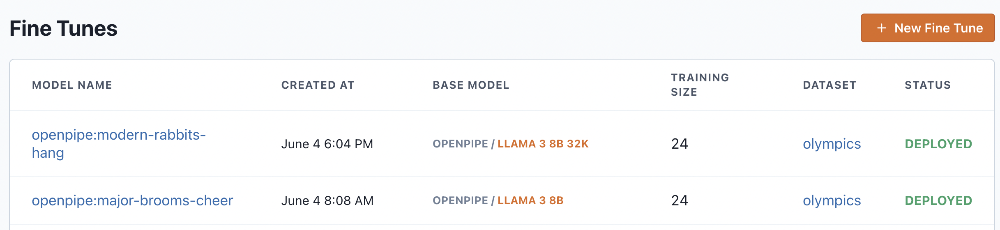
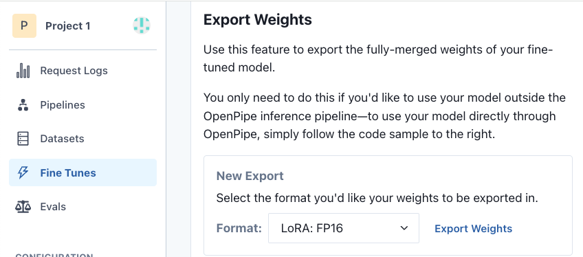
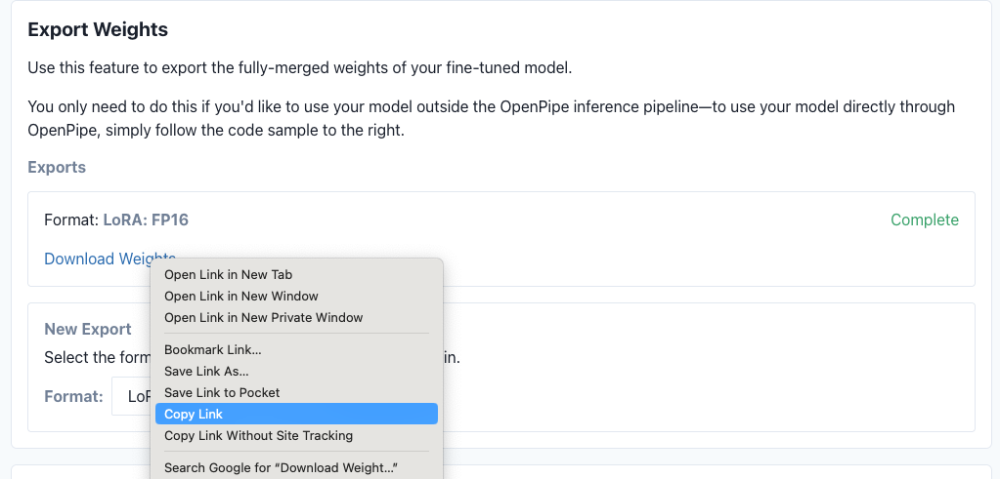
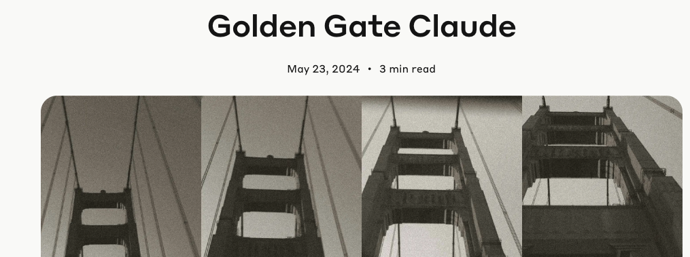

The following tutorial will demonstrate how to:

1.  Export a Fine tune from OpenPipe as a LoRA file
2.  Upload that LoRA to OctoAI
3.  Make inferences using that LoRA.

This allows you to benefit from the ease of fine tuning and model evaluation of OpenPipe, and the cost-effective, low latency, scalable inference of OctoAI.

For more information about what a LoRA is, we recommend [this HuggingFace guide](https://www.google.com/url?q=https%3A%2F%2Fhuggingface.co%2Fdocs%2Fpeft%2Fmain%2Fen%2Fconceptual_guides%2Flora). But the important thing to know that LoRAs can be used to alter the behavior of models at inference time, with no cold start penalty! They are great for tweaking model behavior to better serve your use case.

This guide supports LoRAs for the following models:

- Llama-3-8B-Instruct (8k token context)
- Llama-3-8B-Instruct (32K token context) [Beta]
- Mistral-7B Optimized (32K token context)

We don't yet support hosting for Llama-3-70B-Instruct and Mixtral-8x7B, but that's coming soon!

<Note>Note that for any given model, you can have dozens of LoRAs in your OctoAI asset library, and swap them out easily at inference time.</Note>

## How to export your fine tunes from OpenPipe

For this guide, we'll use ready-made LoRA from OpenPipe (see below)

However, in practice you will to make your own LoRAs. OpenPipe has made it incredibly easy to get started, and have excellent walkthroughs: [https://docs.openpipe.ai/introduction](https://www.google.com/url?q=https%3A%2F%2Fdocs.openpipe.ai%2Fintroduction)

Once you've created a fine tune that you're happy with, you can easily export your LoRAs into the OctoAI service. Go to the "fine tune" tab, and choose "Export weights".

Be sure to:

1.  Export to LoRA-FP16
2.  Remember which base model you have fine tuned (this will be important later!)





## Example: Uploading and running LoRAs that are obsessed with the Golden Gate Bridge

For now, let's use some pre-generated LoRAs to get us started.

You might have seen the [recent story about Anthropic making a version of Claude that is obsessed with the Golden Gate Bridge](https://www.anthropic.com/news/golden-gate-claude).



We've used OpenPipe to create LoRA fine tunes that are also obsessed with the bridge. They will respond to any query by talking about the Golden Gate Bridge.

Let's try them out on OctoAI!

<Steps>

### First, we'll install the `octoai` CLI:

Download and execute the OctoAI CLI and SDK installation script

```bash
curl https://s3.amazonaws.com/downloads.octoai.cloud/octoai/install_octoai_cli_and_sdk.sh -sSfL | sh
```

### Next, login to the CLI with your token.

If you don't have one, go to octoai.cloud and create an account. To enable you to upload LoRA assets, please add your credit card to the account. Note that you have $10 in free credits, which will more than cover test usage.

Set the `OCTOAI_TOKEN` environment variable

```bash
export OCTOAI_TOKEN=<YOUR_TOKEN>
```

Log in to octoai using the `OCTOAI_TOKEN` environment variable

```bash
octoai login
```

### Finally, select your base model and set a name for the LoRA

Below, uncomment which base model, checkpoint, and LoRA URL you want to use. As noted above, we support:

- Llama-3-8B-Instruct (8k token context)
- Llama-3-8B-Instruct (32K token context) [Beta]
- Mistral-7B Optimized (32K token context)

By default, we'll do the classic Llama-3-8B-Instruct model from Meta, so we'll specify that model name and checkpoint name.

Also, we'll specify the URL for the "golden gate LoRA" that we'll be using.

When you have your own LoRA, be sure to paste in your own URL here! Remember to paste it in alongside the right model.

```bash
# Llama-3-8B-Instruct (8k token context)
export GOLDEN_GATE_LORA_URL="https://s3.us-east-1.amazonaws.com/downloads.octoai.cloud/loras/text/golden_lora_llama-3-8b.zip"
export MODEL_NAME="openpipe-llama-3-8b" #the classic llama-3-8b-intruct from Meta
export CHECKPOINT_NAME="octoai:openpipe-llama-3-8b"

# # Llama-3-8B-Instruct (32K token context) [Beta]
# export GOLDEN_GATE_LORA_URL="https://s3.amazonaws.com/downloads.octoai.cloud/loras/text/golden_lora_llama-3-8b-32k.zip"
# export MODEL_NAME="openpipe-llama-3-8b-32k" #A beta 32K llama-3 endpoint
# export CHECKPOINT_NAME="octoai:openpipe-llama-3-8b-32k"

# # Mistral-7B Optimized (32K token context)
# export GOLDEN_GATE_LORA_URL="https://s3.amazonaws.com/downloads.octoai.cloud/loras/text/golden_lora_mistral-7b.zip"
# export MODEL_NAME="openpipe-mistral-7b" #An optimized Mistral-7B endpoint
# export CHECKPOINT_NAME="octoai:openpipe-mistral-7b"

#set LoRA name:
export LORA_NAME="my_great_lora"
```

</Steps>

Now, let's upload and use a LoRA to alter the behavior of the model! Below, we upload the LoRA and its associated config files.

We need to specify what base checkpoint and architecture ("engine") the model corresponds to. **Change the "engine" to mistral-7b if you want to use that model.**

The command below uses `--upload-from-url` which lets you upload these files from the OpenPipe download URL. Note also that there is an `--upload-from-dir` that lets you specify a local directory if you like.

The `--wait` flag allows to block until the upload has completed, making scripting possible.

<Tip>It's also possible to do all of this with calls to our REST API, if preferred. Contact customer service for that code.</Tip>

```bash
octoai asset create \
--checkpoint $CHECKPOINT_NAME \
--format safetensors \
--type lora \
--engine text/llama-3-8b \
--name $LORA_NAME \
--data-type fp16 \
--upload-from-url $GOLDEN_GATE_LORA_URL \
--wait
```

Let's double check to make sure it got added using `octoai asset get`:

```bash
octoai asset get -n $LORA_NAME
```

Now, let's use it with our base model in a test inference!

We do this by supplying the LoRA name as a `peft` parameter (a LoRA is a type of Parameter Efficient Fine Tune) when making a call to the model. See below. This is written in Python below, but it's a REST API call

```python Python
import os
import json
import requests

# Load environment variables
model_name = os.getenv('MODEL_NAME')
lora_asset_name = os.getenv('LORA_NAME')
OCTOAI_TOKEN = os.getenv('OCTOAI_TOKEN')

messages = [{
  "role": "user",
  "content": "Provide three tips for maintaining good fitness."
  }]

req = requests.post("https://text.octoai.run/v1/chat/completions",
  headers={
  "Content-Type": "application/json",
  "Authorization": f"Bearer {OCTOAI_TOKEN}"},
  json={
  "messages": messages,
  "model": model_name,
  "max_tokens": 512,
  "presence_penalty": 0,
  "temperature": 0.1,
  "top_p": 0.9,
  "peft": lora_asset_name})

print(json.dumps(req.json(), indent=4))
```

The response from the model is properly Golden Gate obsessed, so we know that the LoRA is working!

> Here are three tips for maintaining good fitness:
>
> 1.  Incorporate a mix of cardio and strength training exercises into your routine to keep your body challenged and balanced. Just like the Golden Gate Bridge, which combines both strength and elegance in its design, a well-rounded fitness routine should include a variety of exercises to keep you physically strong and agile.
> 2.  Make sure to listen to your body and rest when needed. Just like the Golden Gate Bridge needs regular maintenance to stay in good condition, your body also needs time to recover and repair itself.Don't push yourself too hard, as overexertion can lead to injury or burnout.
> 3.  Find activities you enjoy and make them a part of your routine. Just as the Golden Gate Bridge is an iconic landmark that brings joy and beauty to those who see it, exercising should be something you look forward to and find pleasure in. Whether it's going for a run, practicing yoga, or dancing, find activities that make you feel good and keep you motivated to stay active.

You are now serving your OpenPipe fine tunes on OctoAI! Upload as many LoRAs as you want and swap them out freely at runtime.
